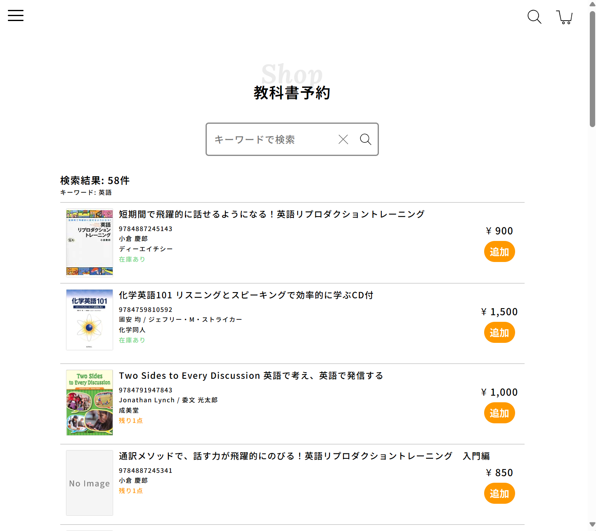

# 「はたらく」とは

---

## 「将来の夢」はありますか？

- ある人は素敵、ない人は別にそれが普通

---

## 仕事をする理由は人それぞれ

- 生活するために稼ぐ
- やりたいことを仕事にできるから

---

## 人生は「偶然」によって左右される

- 出会える「偶然」は経験の積み重ねで決まる
- 中岡の場合
  - 高校ではゲームばかり
  - 大学に入って、ゲームの裏側であるプログラムを知りたいと思うように

---

---

## まとめ

- 将来の目標は変化していくもの
- 「偶然」をつかむためにできることを精いっぱいやろう
  - 勉強、部活、趣味、…
- 好きなことがあれば、「スペシャリスト」を目指そう
